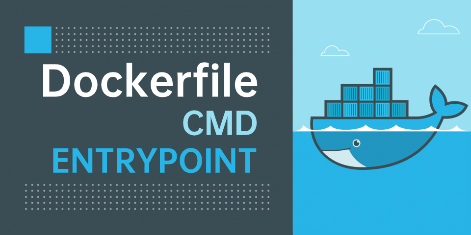

# Dockerfile 的 CMD 和 ENTRYPOINT



<br ><br >

因工作需要把一些项目迁移到了容器中，巩固和重新学习了镜像构建的一些知识。
其中 `CMD` 和 `ENTRYPOINT` 作为容器启动入口，对于应用来说是必须要了解和掌握的内容。

## CMD

> 根据 [docker 官网文档](https://docs.docker.com/engine/reference/builder/#cmd) 来看，`CMD` 有 3 种用法：
>
> - `CMD ["executable","param1","param2"]` （`exec form`，官方推荐的使用方式）
> - `CMD ["param1","param2"]` （作为默认参数，给 `ENTRYPOINT` 使用）
> - `CMD command param1 param2` （`shell form`）

`Dockerfile` 中只能有一个 `CMD` 声明，如果有多个只有最后一个会生效。

### exec form

    `CMD ["executable","param1","param2"]` （`exec form`，官方推荐的使用方式）

`exec form` 默认是没有 shell 进程的，直接以可执行程序来启动应用。 在我看来有利有弊吧：

让应用程序作为 `PID=1` 的进程，可以接收 `Unix` 信号，比如 `docker stop <container>` 可以接收到 `SIGTERM`，更方便与外部沟通。

但是也因为没有 shell 进程，连变量替换这种基本功能都没有。
比如，`CMD ["echo","$HOME"]`，其中的 `$HOME` 是不会正常解析的，需要写成 `CMD ["/bin/bash","-c","echo $HOME"]`

### 作为 ENTRYPOINT 的默认参数

    `CMD ["param1","param2"]` （作为默认参数，给 `ENTRYPOINT` 使用）

下面再说。

### shell form

    `CMD command param1 param2` （`shell form`）

没有中括号， `command` 默认是在 `/bin/sh -c` 中执行的，如果应用对于 `sh` 和 `bash` 有要求，需要注意下。

使用示例：

```Dockerfile
FROM centos

CMD echo "hello world"
```

如果填的是 `/bin/bash xxx.sh` ，那么就是在 `sh` 中调用了 `bash` 去执行脚本。

## ENTRYPOINT

> An `ENTRYPOINT` allows you to configure a container that will run as an executable.

从 [这句话](https://docs.docker.com/engine/reference/builder/#entrypoint) 中可以看出，`ENTRYPOINT` 才是定义容器启动后的执行体的，虽然 `CMD` 在一些场景上也能实现 `入口` 的作用，但本质上 `ENTRYPOINT` 才是入口，`CMD` 是入口的 `参数`。

它有 2 种用法：

### exec form

```Dockerfile
ENTRYPOINT ["executable", "param1", "param2"]
```

这种方式类似于 `CMD` 的 `exec form`，但是在 shell 环境下的，应该是 `/bin/sh`。
此时 `CMD` 的内容会作为 `ENTRYPOINT` 的参数，另外，`CMD` 的内容可以被 `docker run [image]` 后面有内容覆盖。

    如果想覆盖 `ENTRYPOINT` 可以使用 `--entrypoint`

举个例子：

```bash
# Dockerfile
FROM centos

CMD ["hello tom"]
ENTRYPOINT ["echo"]

# 无参数
docker run image
# => hello tom

# CMD 被覆盖
docker run image hello world
# => hello world
```

### shell form

```Dockerfile
ENTRYPOINT command param1 param2
```

第二种是 shell 模式，此种方式的 `CMD` 不会作为 `ENTRYPOINT` 的参数。

举个例子：

```bash
# Dockerfile
FROM centos

CMD ["hello tom"]
ENTRYPOINT echo

# 无参数
docker run image
# 无输出

# CMD 被覆盖
docker run image hello world
# 无输出
```

## 总结

> 上面分析太长可以直接跳到这里看结论...
>
> 1.  使用 `ENTRYPOINT` 作为应用的启动入口
> 2.  如果启动程序比较复杂（比如含有一些配置工作），可以写个 `entrypoint.sh` 放在 `ENTRYPOINT` 中
> 3.  `CMD` 放可变部分，作为 `ENTRYPOINT` 的默认参数

比如：

```Dockerfile
FROM centos

ENTRYPOINT ["bash", "/projects/entrypoint.sh"]
```
