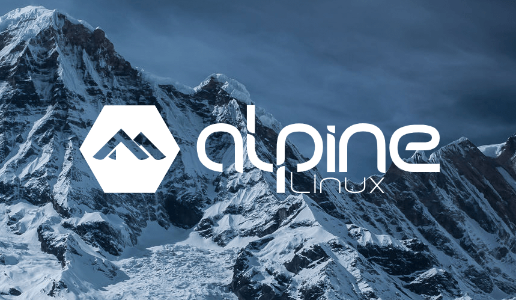
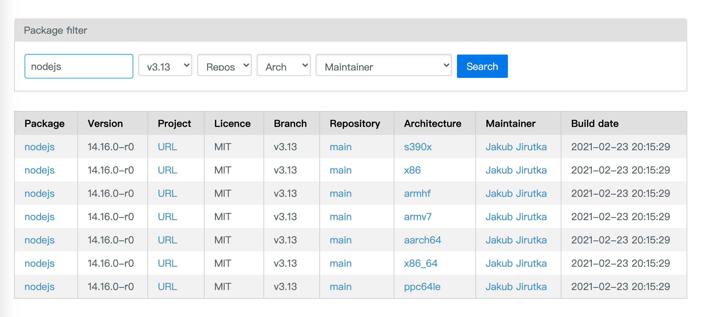

# 基于 Alpine 制作 nodejs 极简镜像

最近接触了 [Alpine](https://www.alpinelinux.org/) 系统，它是一个面向安全的轻型 `Linux` 发行版。
有自己的包管理工具 `apk`，可以通过 [https://pkgs.alpinelinux.org/packages](https://pkgs.alpinelinux.org/packages) 或者 `apk info` 来查询可安装的软件。

## Alpine 的优势

<!--  -->

> 为什么要选用 `Alpine` 作为基础镜像？ 因为它体积太小啦，只有 `5M` 🎉🎉🎉
> 对比其他 os 比如 `Ubuntu` 或者`CentOS` 有约 `200M`，拥有极大的体积优势。

公司项目从稳定性考虑当然选`CentOS`，但是自己玩的话特别是对于我这种抠抠索索的人来说，`Alpine` 极受亲睐。

## 注意事项

最初我尝试从 nodejs 官网直接拉取二进制文件来进行安装，但是一直报错：

```bash
env: ‘node’: No such file or directory
```

后来了解到，nodejs 的运行需要 libc 的支持，而社区的 alpine 镜像并不能满足需求，需要使用 `apk` 来进行安装。
可以在 [https://pkgs.alpinelinux.org/packages](https://pkgs.alpinelinux.org/packages) 查看可用的软件版本，执行 `apk add [software]=[version]`。



## 基于 Dockerfile 构建

先写好配置文件：

```bash
vim Dockerfile
```

```Dockerfile
FROM alpine:3.13.4
RUN sed -i "s/dl-cdn.alpinelinux.org/mirrors.aliyun.com/g" /etc/apk/repositories && \
    apk add --no-cache nodejs=14.16.0-r0 && \
    apk add --no-cache npm=14.16.0-r0 && \
    npm i pm2 -g
```

基于 Dockerfile 构建:

```bash
docker build -t alpine-node-pm2 .
```

国内访问 `apk` 仓库太慢，建议替换仓库地址为国内镜像。

安装包记得添加 `--no-cache`，不用本地 cache 进行安装，这里也会避免生成 cache 产生无用的缓存安装文件。
`pm2` 可以看情况添加，虽然会占用不少体积，但是我觉得 node 程序最好还是用 `pm2-runtime` 来托管。

```bash
REPOSITORY          TAG                 IMAGE ID            CREATED             SIZE
alpine-node-pm2     latest              b49a6aa7bdc1        1 minutes ago       94MB
alpine-node         latest              f0fe9198b087        1 minutes ago       60.9MB
alpine              3.13.4              49f356fa4513        3 days ago          5.61MB
```

可以看到，基于 `alpine` 的 `node` 镜像只有 `61M`，哪怕添加了 `pm2` 也只有 `96M`，与`Ubuntu`、`CentOS`等动则几百 M 的镜像相比，极具诱惑力。

## 相关链接

[整理一些常用的 helm chart 和 dockerfile](https://github.com/shalldie/helm-charts)
