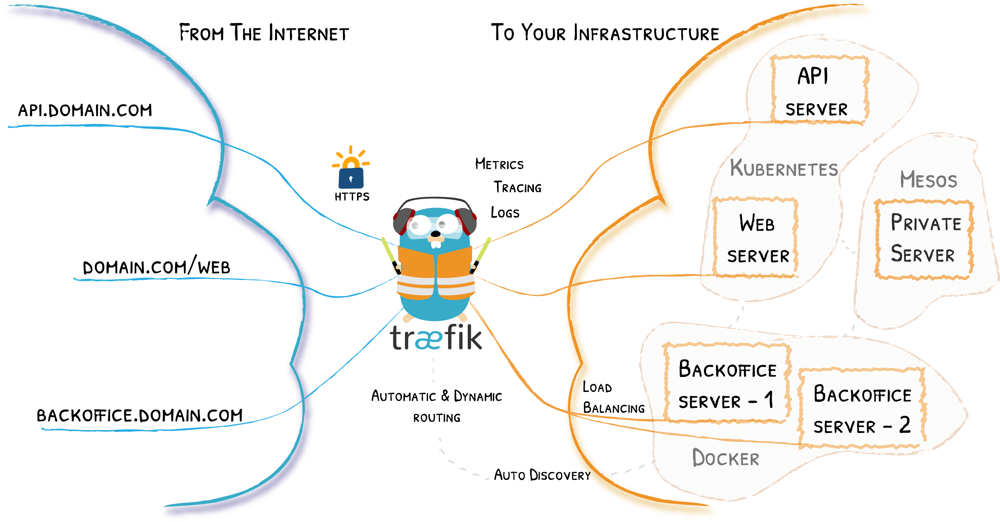

# 使用 Traefik 边缘路由器



## 简介

`Traefik` 是一个现代化的反向代理、负载均衡工具，使得微服务的部署更加容易。

Traefik 兼容所有主流的集群技术，比如 `Docker`, `Swarm mode`, `Kubernetes`, `Marathon`, `Consul`, `Etcd`, `Rancher`, `Amazon ECS`, `...`

最吸引我的是，它的配置是 `自动` 且 `动态` 的，用人话说就是：

    会自动监听配置文件改动，自动发现新服务接入，并更新自己的配置，无需人工重启。

## 与 nginx 相比

很长一段时间我都在用 `nginx` 作为流量分发的入口，`nginx` 配置简单，快速，功能强大，成熟稳定，balabala...

如今我把应用入口换成了 `Traefik`，并不是说 `nginx` 比之差一些，而是 `Traefik` 有一些很强大的功能，作为 `边缘路由器` 更合适、更 cool，`nginx` 在其它场景下依然使用很广泛，这里列一些 `Traefik` 的优势：

1. 自带一个 dashboard 界面，可视化更直观。
2. 自带 `服务发现` 能力，可自动监听配置改动、发现新服务，并自动更新无需人工重启。（像不像 Ingress？）
3. 更现代，因为比较新，所以考虑了很多容器技术、编排工具，可以支持 `本地配置`、`Docker`、`Kubernetes` 等。
4. 提供了 `Let's Encrypt` 证书工具，我用它替换掉了 `acme.sh`，毕竟原生支持更方便，作为 `边缘路由器` 的角色也很合理。
5. 折腾一下 ...

## 安装

### 使用二进制文件

可以从 [Github Release](https://github.com/traefik/traefik/releases) 页面获取最新的二进制文件。

```bash
# 解压
& tar -zxvf traefik_${traefik_version}_linux_${arch}.tar.gz

# 然后运行
& ./traefik --help
```

### 使用官方 Docker 镜像

可以在 [Docker Official Images](https://hub.docker.com/_/traefik) 选择一个镜像来运行。

```bash
docker run -d -p 8080:8080 -p 80:80 \
    -v $PWD/traefik.toml:/etc/traefik/traefik.toml traefik:v2.4
```

### 使用 helm

可以从 [traefik-helm-chart](https://github.com/traefik/traefik-helm-chart) 获取最新的 helm chart。

```bash
# 1. 添加 repo
& helm repo add traefik https://helm.traefik.io/traefik
# 2. update
& helm repo update
# 3. install
& helm install traefik traefik/traefik
```

    想在 Kubenetes 使用通过 helm 安装最方便，traefik-helm-chart 的配置参数挺多，了解基本使用后也方便触类旁通。
    二进制方式，和 docker 方式差不多，本文会着重介绍 docker 方式。

## 配置发现

### 概述

Traefik 的服务发现，是通过 Providers 来实现的。
通过查询 providers 的 API 来查找有关路由的相关信息，Traefik 每次检测到变更，都会动态更新路由。

官方支持的 providers 有很多，这里介绍常用的 3 种：

| Provider   | 类型   | 配置类型       |
| :--------- | :----- | :------------- |
| File       | 手动   | TOML/YAML 文件 |
| Docker     | 编排器 | 标签           |
| Kubernetes | 编排器 | 自定义资源     |

可以从 [这里查看](https://doc.traefik.io/traefik/providers/overview/#supported-providers) 更多支持的 providers。

### File

file provider 可以让我们通过 TOML 或者 YAML 文件来定义动态配置。
