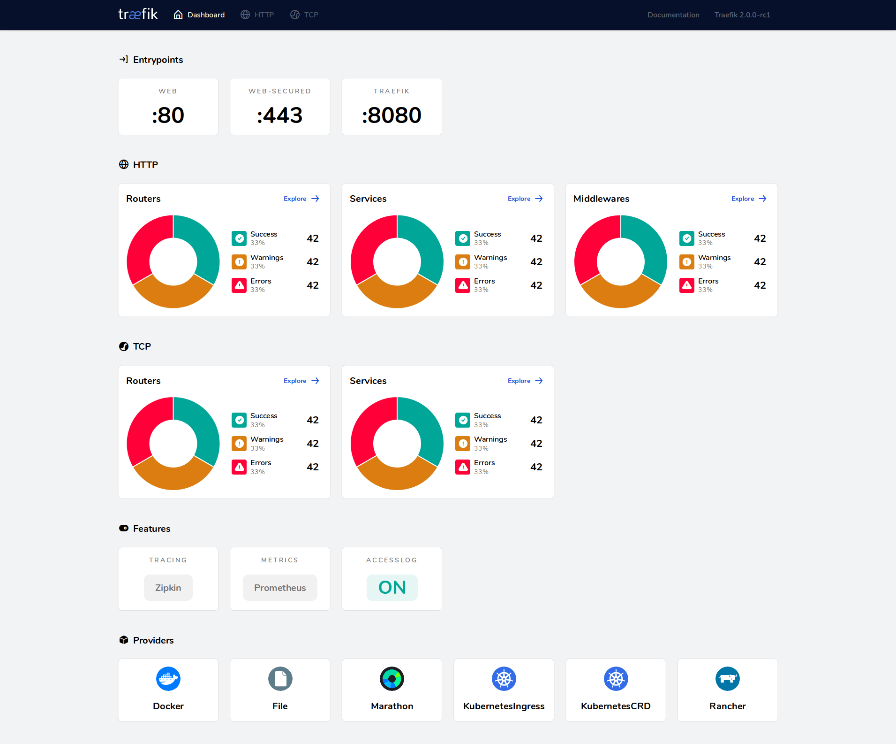

# 使用 Traefik 边缘路由器


## 简介

> `Traefik` 是一个现代化的反向代理、负载均衡工具，使得微服务的部署更加容易。
> `Traefik` 兼容所有主流的集群技术，比如 `Docker`, `Swarm mode`, `Kubernetes`, `Marathon`, `Consul`, `Etcd`, `Rancher`, `Amazon ECS`, `...`

最吸引我的是，它的配置是 `自动` 且 `动态` 的，用人话说就是：

    会自动监听配置文件改动，自动发现新服务接入，并更新自己的配置，无需人工重启。

## 与 Nginx 相比

很长一段时间我都在用 `Nginx` 作为流量分发的入口，`Nginx` 配置简单，快速，功能强大，成熟稳定，balabala...

如今我把应用入口换成了 `Traefik`，并不是说 `Nginx` 比之差一些，而是 `Traefik` 有一些很强大的功能，作为 `边缘路由器` 更合适、更 cool，`Nginx` 在其它场景下依然使用很广泛，这里列一些 `Traefik` 的优势：

1. 自带一个 dashboard 界面，可视化更直观。
2. 自带 `服务发现` 能力，可自动监听配置改动、发现新服务，并自动更新无需人工重启。（像不像 Ingress？）
3. 更现代，因为比较新，所以考虑了很多容器技术、编排工具，可以支持 `本地配置`、`Docker`、`Kubernetes` 等。
4. 提供了 `Let's Encrypt` 证书工具，我用它替换掉了 `acme.sh`，毕竟原生支持更方便，作为 `边缘路由器` 的角色也很合理。
5. 折腾一下 ...

## 安装

### 使用二进制文件

可以从 [Github Release](https://github.com/traefik/traefik/releases) 页面获取最新的二进制文件。

```bash
# 解压
& tar -zxvf traefik_${traefik_version}_linux_${arch}.tar.gz

# 然后运行
& ./traefik --help
```

### 使用官方 Docker 镜像

可以在 [Docker Official Images](https://hub.docker.com/_/traefik) 选择一个镜像来运行。

```bash
docker run -d -p 8080:8080 -p 80:80 \
    -v $PWD/traefik.toml:/etc/traefik/traefik.toml traefik:v2.4
```

### 使用 helm

可以从 [traefik-helm-chart](https://github.com/traefik/traefik-helm-chart) 获取最新的 helm chart。

```bash
# 1. 添加 repo
& helm repo add traefik https://helm.traefik.io/traefik
# 2. update
& helm repo update
# 3. install
& helm install traefik traefik/traefik
```

想在 Kubenetes 使用通过 helm 安装最方便，traefik-helm-chart 的配置参数挺多，了解基本使用后也方便触类旁通。
二进制方式，和 docker 方式差不多，本文会着重介绍 docker 方式。

## 配置发现

> 配置分为 `静态配置` 和 `动态配置` 两种，`静态配置` 作为 `traefik` 的启动配置，`动态配置` 可以是完全动态的路由配置。
> `Traefik` 在启动的时候，会在以下位置中搜索名为 `traefik.toml`（或 `traefik.yml`、`traefik.yaml`）的文件（后文皆以 `.yml` 为例）：

- `/etc/traefik/`
- `$XDG_CONFIG_HOME/`
- `$HOME/.config/`
- `. (工作目录)`

Traefik 会自动发现 `动态配置`，并更新自身。也被成为：`配置发现`。

### 概述

Traefik 的服务发现，是通过 Providers 来实现的。
通过查询 providers 的 API 来查找有关路由的相关信息，Traefik 每次检测到变更，都会动态更新路由。

官方支持的 providers 有很多，这里介绍常用的 3 种：

| Provider   | 类型   | 配置类型       |
| :--------- | :----- | :------------- |
| File       | 手动   | TOML/YAML 文件 |
| Docker     | 编排器 | 标签           |
| Kubernetes | 编排器 | 自定义资源     |

可以从 [这里查看](https://doc.traefik.io/traefik/providers/overview/#supported-providers) 更多支持的 providers。

### File

file provider 可以让我们通过 TOML 或者 YAML 文件来定义动态配置。

在 `静态配置` 中，预先声明要监听的 `文件` 或者 `文件夹`：

```yaml
providers:
  file:
    # 文件 跟 目录，2选1
    # 要监听的文件
    filename: dynamic_conf.yml
    # 要监听的目录
    directory: /path/to/config
    # 允许 traefik 自动 watch 配置文件的变化
    watch: true
```

### Docker

在启动容器的时候，可以以标签的形式通知、配置，以让 Traefik 来完成自动化配置。 如果容器停止，Traefik 也会自动销毁相关配置。

使用 `静态配置`，告知 `Traefik` 去监听 Docker 的生命周期。

```yaml
providers:
  # 监听docker生命周期
  docker:
    # 用于连接所有容器的默认 docker 网络，默认为 empty
    network: traefik-network
```

然后启动容器的时候添加 label，`Traefik` 会根据 label 的配置去生成对应路由。

```yaml
# docker-compose.yml
version: '3'
services:
  blog:
    image: 'xxx:latest'
    labels:
      - traefik.http.routers.blog.rule=PathPrefix(`/`)
      - traefik.http.services.blog.loadbalancer.server.port=8080
networks:
  default:
    name: traefik-network
    external: true
```

以上的 labels 会生成如下动态配置：

```yaml
http:
  # 生成一个 router 规则
  routers:
    blog:
      rule: 'PathPrefix(`/`)'
      service: blog
  # 生成一个 service，并配置访问的 port
  services:
    blog:
      loadBalancer:
        servers:
          - url: 'http://traefik-network:8080'
```

### Kubernetes

在 k8s 中使用 Traefik 作为 Ingress Controller 是一个不错的选择，新加路由只用加一个普通的 Ingress 配置文件：

```yaml
# ingress.yaml
kind: Ingress
apiVersion: extensions/v1beta1
metadata:
  name: ingress-traefik
  namespace: xxx
spec:
  rules:
    - http:
        paths:
          - path: /
            backend:
              serviceName: some-name
              servicePort: some-port
```

使用 helm 安装 Traefik 是一种很方便的方式，可以参考：[https://github.com/traefik/traefik-helm-chart](https://github.com/traefik/traefik-helm-chart)

## 路由和负载均衡

### 概览

#### 流量流转

当请求进来当时候我们看下发生了啥，这样更有助于理解 Traefik 的一些概念。

1. 在我们启动 Traefik 的时候，我们要定义 `entrypoints`（静态配置），表示流量的入口。
2. 然后连接到 `entrypoints` 的 `routes` 去判断是否符合定义的规则。
3. 如果符合，就用 `middleware` 中间件去处理下。
4. 最后把流量打到 `services` 上面。


#### 各部分职责：

- `Providers` 来发现基础设施上存在的服务（它们的 IP、运行状况等...）
- `Entrypoints` 监听 `traffic` 的流量入口 (ports, ...)
- `Routers` 分析请求 (host, path, headers, SSL, ...)
- `Middlewares` 会把请求做一些调整 (authentication, rate limiting, headers, ...)

#### 示例

我们用 `File Provider` 来看一个完整的例子，首先是 `静态配置`：

```yaml
entryPoints:
  web:
    # 监听 8081 端口的请求
    address: :8081

providers:
  # 配置 file provider 监听目录，可以动态定义 routers / middlewares / services
  file:
    directory: /path/to/dynamic/conf
    watch: true
```

然后我们就可以在 `/path/to/dynamic/conf` 目录中去定义 `动态配置`：

```yaml
# http 路由部分
http:
  routers:
    # 定义一个路由去处理请求
    to-whoami:
      # 路由的规则是 Host:example.com，而且请求是 /whoami/ 开头
      rule: 'Host(`example.com`) && PathPrefix(`/whoami/`)'
      # 如果规则匹配上，就用以下中间件处理
      middlewares:
        - test-user
      # 最后再把流量打到 `whoami` 的服务上。
      service: whoami

  middlewares:
    # 定义一个中间件，用来验证用户身份。中间件可以在这里查阅：https://doc.traefik.io/traefik/middlewares/overview/
    test-user:
      basicAuth:
        users:
          - test:$apr1$H6uskkkW$IgXLP6ewTrSuBkTrqE8wj/

  services:
    # 定义一个服务，以及如何把它跟现有服务关联起来
    whoami:
      loadBalancer:
        servers:
          - url: http://private/whoami-service
```

### EntryPoints

`EntryPoints` 就是 `Traefik` 的流量入口，定义了监听哪个端口，或者监听 TCP 还是 UDP。

```yaml
# example
## 静态配置
entryPoints:
  web:
    address: ':80'

  web-secure:
    address: ':443'
```

### Routers

`Routers` 负责将请求转发到指定服务，可以将指定 `EntryPoints` 的，符合自己规则 `Rules` 的请求，经过中间件 `Middlewares` 处理后，转发到指定的 `Service` 上面。

```yaml
## 动态配置
http:
  routers:
    router-name:
      # 监听指定 entryPoints，默认所有
      entryPoints:
        - 'websecure'
        - 'other'
      # 指定该路由规则
      rule: 'Host(`traefik.io`) && Path(`/traefik`))'
      # 指定服务
      service: 'service-name'
```

### Services

`Services` 负责配置如何获取最终将处理传入请求的实际服务。

```yaml
## 动态配置
http:
  services:
    service-name:
      loadBalancer:
        # loadBalancer 会将流量在多个实例间进行负载均衡
        servers:
          - url: 'http://private-ip-server-1'
          - url: 'http://private-ip-server-2'
```

## HTTPS

`Traefik` 可以使用 `ACME` 自动获取证书，其它方式暂不赘述。

... 直接看例子吧，注释多。

```yaml
# entrypoints，入口
entryPoints:
  # http, 80 端口
  web:
    address: :80
    http:
      # 会重定向到 https
      # https://doc.traefik.io/traefik/routing/entrypoints/#redirection
      redirections:
        entryPoint:
          to: websecure
          scheme: https
  # https, 443 端口
  websecure:
    address: :443
    http:
      tls:
        certResolver: nosaidResolver
        domains:
          - main: nosaid.com
            sans:
              - www.nosaid.com

# https://doc.traefik.io/traefik/https/acme/#httpchallenge
certificatesResolvers:
  nosaidResolver:
    acme:
      email: hi.xieshuang@gmail.com
      storage: /etc/traefik/acme.json # 要存储的位置，如果使用 docker 记得添加 volume
      httpChallenge:
        entryPoint: web # 对于 http 的请求使用 httpChallenge 方式获取证书
```

## 中间件

> 通过附加到路由，中间件可以在请求发送到服务之前来调整请求。
> 中间件被附件到路由上，是一种在请求发送到你的 服务 之前（或者在服务的响应发送到客户端之前）调整请求的一种方法。

Traefik 内置了许多不同功能的中间件，可以修改请求，头信息，重定向，添加身份验证等等。

中间件可以通过链式组合的方式来满足业务需求。

```yaml
http:
  routers:
    ttyd-router:
      rule: 'PathPrefix(`/prefix`)'
      service: some-service
      middlewares:
        - prefix-middleware

  middlewares:
    prefix-middleware:
      stripPrefix:
        prefixes:
          - '/prefix'
```

比如上面例子中，中间件就会抹去 `/prefix` 前缀。
如果请求 `/prefix/a/b`，在 `some-service` 接收到请求的时候，就变成了 `/a/b`。

## Dashboard

`Traefik` 自带了一个 `Web UI`，叫做 `Dashboard`。可以快速、便捷、直观的查看当前的所有 `entryPoints`、`routes`、`middleWares`、`balabala`



`Dashboard` 的开启方式比较简单，添加 `静态配置`，就可以访问 `8080` 端口来访问了。

```yaml
# 开启 dashboard
# https://doc.traefik.io/traefik/operations/dashboard/#insecure-mode
api:
  insecure: true
```

## 参考

[Traefik Official Document](https://doc.traefik.io/traefik/)

[一文搞懂 Traefik2.1 的使用](https://www.qikqiak.com/post/traefik-2.1-101/)
