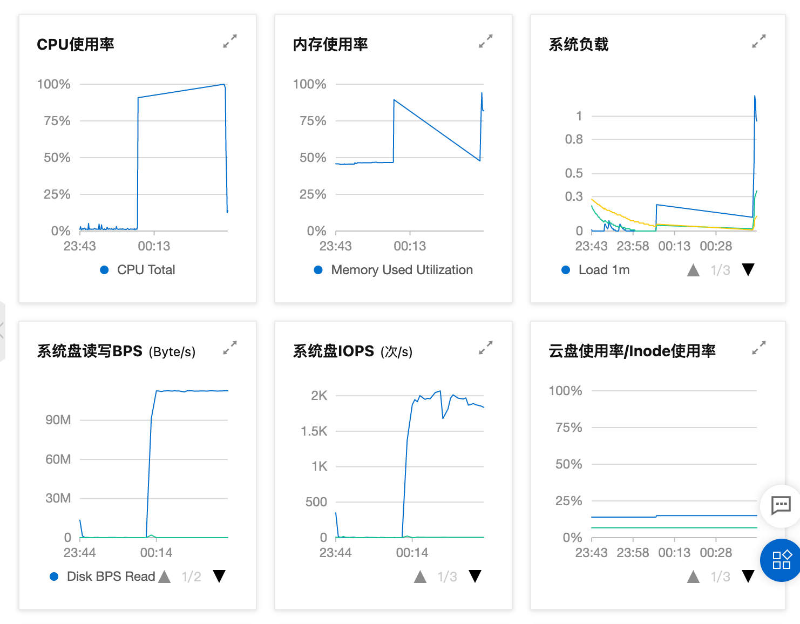
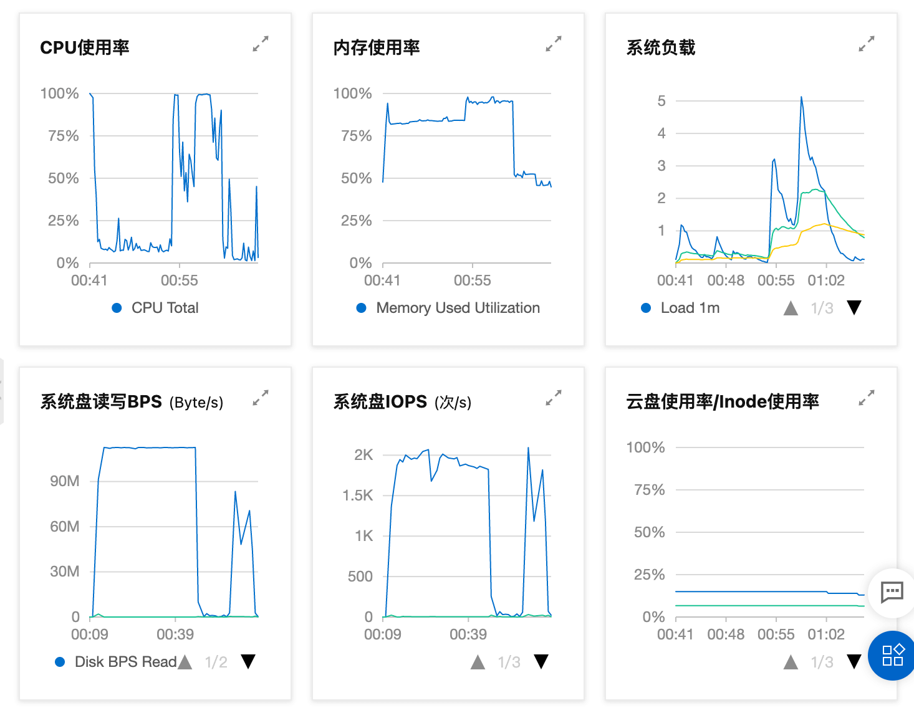

# 在 1 核 1G 上安装 k3s

工作要用到所以想学习下 k8s 相关知识，之前只是会用些常规命令，并没有系统学习过。
，，，还特地买了本书，结果发现自己服务器只有 1 核 1G ，抠抠索索的我自然不愿意花钱升配置，后来发现了 k3s 这个替代品，反正 api 都一样，于是产生了把博客服务迁移到 k3s 的想法。

## 检查配置

要求内存 512M，看了下我还有 523M，似乎够用，撸起袖子干 😂😂

```bash
[root@xielaobandeos ~]# free -h
              total        used        free      shared  buff/cache   available
Mem:          981Mi       343Mi       252Mi       2.0Mi       385Mi       523Mi
Swap:            0B          0B          0B
```

## 安装

使用国内的源可以大幅度减少下载资源的时间。
另外添加 `INSTALL_K3S_EXEC="--docker"` 可以用 docker 作为容器服务，因为习惯用 docker 所以选择了这种方式。

```bash
curl -sfL http://rancher-mirror.cnrancher.com/k3s/k3s-install.sh | \
INSTALL_K3S_MIRROR=cn \
INSTALL_K3S_EXEC="--docker" \
sh -s -
```

整个安装过程还是挺快的，之后可以使用下面的命令，来查看所有组件，是否都成功安装。

```bash
[root@xielaobandeos ~]# kubectl get all -n kube-system
NAME                                          READY   STATUS      RESTARTS   AGE
pod/local-path-provisioner-5ff76fc89d-h6rcg   1/1     Running     0          40m
pod/metrics-server-86cbb8457f-vbchr           1/1     Running     0          40m
pod/helm-install-traefik-tx72p                0/1     Completed   0          40m
pod/coredns-854c77959c-5bbz7                  1/1     Running     0          40m
pod/svclb-traefik-zdm97                       2/2     Running     0          5m39s
pod/traefik-6f9cbd9bd4-4zrwt                  1/1     Running     0          5m39s

NAME                         TYPE           CLUSTER-IP      EXTERNAL-IP     PORT(S)                      AGE
service/kube-dns             ClusterIP      10.43.0.10      <none>          53/UDP,53/TCP,9153/TCP       41m
service/metrics-server       ClusterIP      10.43.20.160    <none>          443/TCP                      41m
service/traefik-prometheus   ClusterIP      10.43.169.174   <none>          9100/TCP                     5m51s
service/traefik              LoadBalancer   10.43.125.237   172.19.255.58   80:32261/TCP,443:30979/TCP   5m51s

NAME                           DESIRED   CURRENT   READY   UP-TO-DATE   AVAILABLE   NODE SELECTOR   AGE
daemonset.apps/svclb-traefik   1         1         1       1            1           <none>          5m51s

NAME                                     READY   UP-TO-DATE   AVAILABLE   AGE
deployment.apps/metrics-server           1/1     1            1           41m
deployment.apps/coredns                  1/1     1            1           41m
deployment.apps/local-path-provisioner   1/1     1            1           41m
deployment.apps/traefik                  1/1     1            1           5m51s

NAME                                                DESIRED   CURRENT   READY   AGE
replicaset.apps/metrics-server-86cbb8457f           1         1         1       40m
replicaset.apps/coredns-854c77959c                  1         1         1       40m
replicaset.apps/local-path-provisioner-5ff76fc89d   1         1         1       40m
replicaset.apps/traefik-6f9cbd9bd4                  1         1         1       5m39s

NAME                             COMPLETIONS   DURATION   AGE
job.batch/helm-install-traefik   1/1           35m        41m
```

## 问题

安装完会明显感到机器越来越卡，输入个指令要等好久才会响应。
，，，后来 ssh 就直接崩了 =。= 等 15 分钟没动静，不得已重启，重启也花了 10 分钟，估计什么进程阻塞了吧，，，



不过重启后貌似都 ok 了，虽然各项指标都显示服务器承受着极大的压力，cpu 或者内存都接近打满，但至少 ssh 上去看着没啥问题，，，

因为对之前卡死的情况抱着谨慎的态度，于是决定重装一次看看是否之前有啥遗漏。

## 卸载

输入 `k3s` 按下 `tab` 可以看到提供了以下环境变量，`k3s-killall.sh` 是停止所有 k3s 服务，`k3s-uninstall.sh` 是把所有 k3s 组件卸载。

实测 `k3s-uninstall.sh` 执行后一些 docker 的镜像、容器还是需要自己手动删除，可能跟所选的容器运行时有关吧。

```bash
[root@xielaobandeos blog-docker]# k3s
k3s               k3s-killall.sh    k3s-uninstall.sh
```

## 再试一次



依然是卡死的情况，重启良久，重启后 cpu、内存打满，不敢用。

## 最后

这次的尝试可以说是失败了，最后选择了卸载。我这里 1 核 1G 并不适合运行 k3s 服务，虽然能跑，但也仅仅是能跑而已，不该也不适合跑。

看到有人使用 1 核 1G 最后只上升了 `200M` 内存，似乎跟选择的容器运行时有关？不打算深究了，有兴趣可以访问以下链接：

[如何在一台 1 核 1G 的服务器上部署 Kubernetes](https://gianthard.rocks/a/74)
