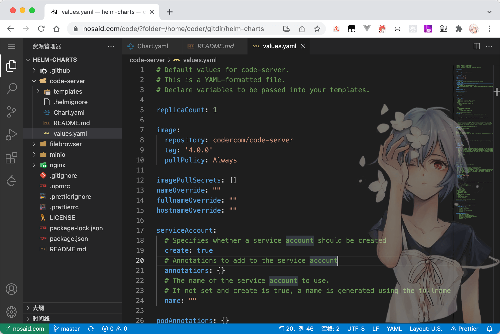
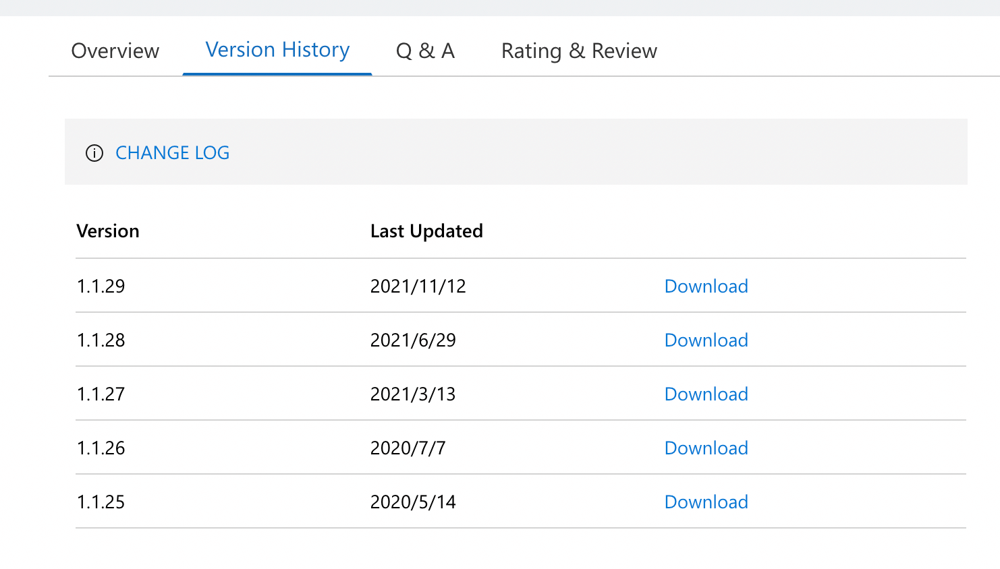
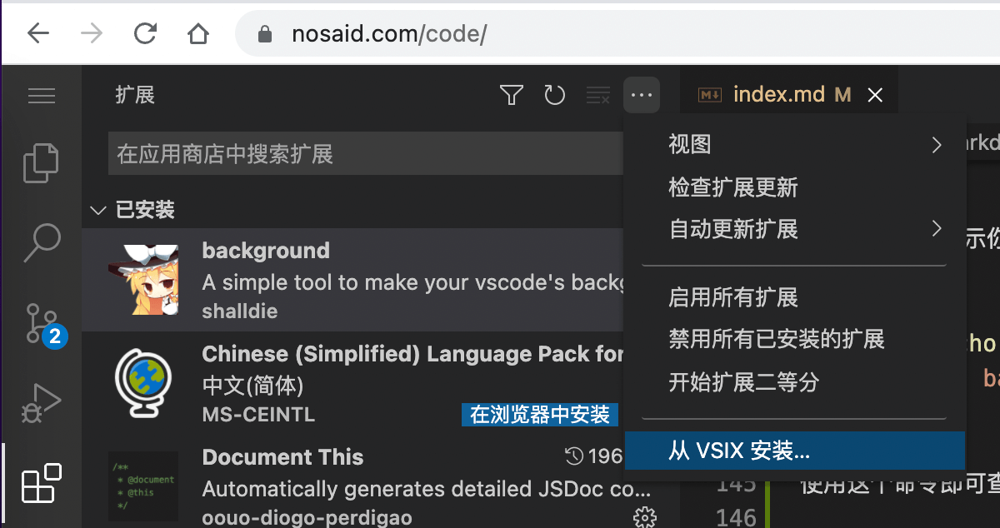

# 在浏览器上写代码

经常在家里的 `windows`、`老 mac`、公司的 `mac m1` 等机器上切换，某天打完游戏也会想写写代码，但是受限于各种 `runtime`、`ide`、`配置`，不能尽兴。搜了搜各种文章，实践了下把 `vscode` 放到浏览器上，之后打开网址就能写代码 >\_<#@!

> 这篇文章主要描述了，
>
> 1. 使用 helm 在 k8s 环境上，部署 code-server 服务。
> 2. 添加插件。
>
> 成品如下图所示：



## 技术选型

对于抠抠索索的我来说，收费的当然不要。剩下两种备选方案：

1. 直接下载 `vscode` 源码，使用 `yarn web` 跑起来。
2. 使用基于 `vscode` 封装程度更完善的 `code-server`。

原本更倾向于直接使用 vscode ，毕竟更官方。但是在尝试、发现以下几个因素后，还是选择了 `code-server`：

- vscode 如今的版本已经没 `yarn web` 指令，在摸索新版本的过程中发现依赖包很多很多，装不上，，，
- 鉴权是绕不开的门槛，`code-server` 已经自带。
- `code-server` 已经有完备的生态，适配多种环境。

## 部署选型

`code-server` 有多种安装、部署方式。 包括 `npm`、`binary`、`brew`、`docker`、`helm` 等。

开发环境当然是 `linux`，作为一个 `docker` 重度用户自然会重视 `干净`。
在发现官方已经体贴的提供了 `helm` 包的时候，[使用 helm 部署](https://coder.com/docs/code-server/latest/helm) 理所当然的成为了最佳选择。

## 使用 helm 部署

假设你已经有了 k8s 环境，否则请去 [官网文档](https://coder.com/docs/code-server/latest) 查阅其他部署方式。

### 准备 helm-chart

官方有提供 [helm-chart](https://coder.com/docs/code-server/latest/helm)，是让我们自己去 clone 仓库，然后修改 values.yaml。

并没有提供一个 `package` 之后的，我在使用的过程中也遇到过一些问题，于是 [copy 了一份](https://github.com/shalldie/helm-charts/tree/master/code-server) 进行了少许修改：

1. 添加 password 配置
2. 把 helm chart 打包了一份

你可以选择官方，或者使用我打包后的。

### values.yaml 配置

官网的 `values.yaml` 即可作为默认配置，有几个地方需要注意。

#### tag

默认配置 tag 是 `4.0.0`，但是截止 `2021/12/15` 还没有在 Docker Hub 发现这个版本，应该没发布。
需要替换成 `3.12.0`。大概是先出文档再发布的节奏，，，

#### NodePort 还是 Ingress

如果愿意用端口访问 code-server，简单的把 port 类型设置为 `NodePort` 就行：

```yaml
service:
  type: ClusterIP # => NodePort
  port: 8080
```

我选择的是 ingress，因为优雅些，毕竟都用 k8s 了。

```yaml
ingress:
  enabled: true
  annotations:
    traefik.ingress.kubernetes.io/router.middlewares: default-middleware-replace-path-prefix-code@kubernetescrd
  #  kubernetes.io/ingress.class: nginx
  #  kubernetes.io/tls-acme: "true"
  hosts:
    - host: nosaid.com
      paths:
        - /code
```

已经内置了这部分配置，如上配置即可把 `/code` 的流量都转发到 `code-server` 上。

有一个地方需要明确下，`code-server` 的 `base url` 是 `/`，因此需要把 `/code/` 的流量代理到内部的 `/`。
我使用的是 `traefik` 作为 ingress-controller，因此添加了个 [插件](https://doc.traefik.io/traefik/middlewares/http/replacepath/) 把 prefix 给干掉了。

如果你的代理服务器是 `nginx`，可以如下配置：

```nginx
location /prefix {
    proxy_pass http://code-server:8080/;
}
```

#### 登陆密码

这个着实让我困惑很久，，，
网上的文档、以及用户习惯、第六感 都没有能够帮我解决如何 设置/修改 密码的问题，不得已看了源码，需要自己在 `values.yaml` 中自己加上一句：

```yaml
# 密码放这里, password here
password: 'somepassword'
```

#### 持久化

我当然不希望服务重启下、升级下、或者其他原因就把之前的文件、安装的各种 runtime 都干掉了，，，
因此需要把容器中的内容持久化，作为个 volume 挂在 hostPath 上。

```yaml
persistence:
  enabled: true
  ## code-server data Persistent Volume Storage Class
  ## If defined, storageClassName: <storageClass>
  ## If set to "-", storageClassName: "", which disables dynamic provisioning
  ## If undefined (the default) or set to null, no storageClassName spec is
  ##   set, choosing the default provisioner.  (gp2 on AWS, standard on
  ##   GKE, AWS & OpenStack)
  ##
  # storageClass: "-"
  accessMode: ReadWriteOnce
  size: 10Gi
  annotations: {}
  # existingClaim: ""
  hostPath: /some/path/somevolume
```

可以看到默认配置是想让我们使用 pvc，我觉得太麻烦直接使用 `hostPath` 搞定 =。=

### 执行安装

我是先把 chart 打包（`helm package .`），放到服务器上，调整配置（`values.yaml`）。然后执行：

```bash
helm install code-server ./code-server-0.0.1.tgz -f values.yaml
```

成功后会额外提示你：

```bash
Password: echo $(kubectl get secret --namespace default code-server -o jsonpath="{.data.password}" | base64 --decode)
```

使用这个命令即可查看当前密码。

## 添加插件

`code-server` 并不是对接的 vscode 插件市场，搜到的插件大部分都已经过时。
使用 `vsix` 安装是最佳的方式。

### 下载/上传



从插件市场找到插件，从这个面板可以看到历史版本的 `vsix` 文件，点击 Download 下载下来。
可以直接用鼠标把文件拖到 `code-server` 的目录中，进行上传。

### 安装插件



如图所示，选择 `从 VSIX 安装...`

## 参考

[Github code-server](https://github.com/cdr/code-server)

[Coder Docs](https://coder.com/docs/code-server/latest)

[VSCode Online 的安裝与配置](https://zhuanlan.zhihu.com/p/342964881)
