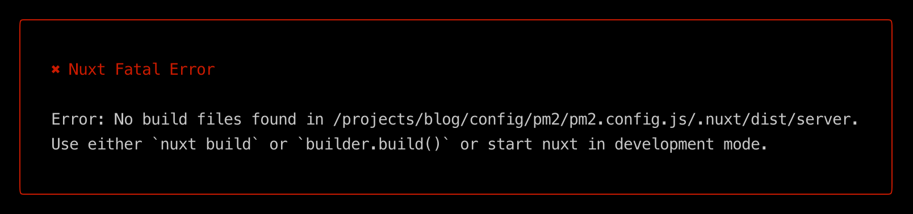

# 当 k8s 遇到 pm2

不久前一个老服务啥都没干重启就崩了，特此记录。

## 质疑的声音

> 有些朋友会质疑两者一起使用的必要性，容器的 `entrypoint` 直接 `node main.js` 不行吗？
> k8s 会处理异常自动重启，多实例负载均衡都是现成的。
> “你可能不需要 pm2”

## 我的看法

确实有功能重合的地方，但我还是坚持使用 `pm2`。

### graceful restart

服务在启动、更新的时候，需要保证新旧服务替换对用户无感知，实现滚动更新，或曰 `graceful restart`。
来避免正在执行任务、处理请求的 pod 突然被关闭，甚至在 `关闭/销毁` 前，还需要有主动关闭数据库连接等操作。

`k8s` 跟 `pm2` 一样，都是通过 `signal` 来让服务主动通知 `ready`，告知服务该 `shutdown` 了。
对于 `signal` 的处理需要在应用程序中，我们只用考虑对接 `pm2`，`pm2` 已经做了对各种服务编排的兼容，写业务的不应该关心太多环境问题。

对接了 pm2，就同时实现了在 `宿主机`、`k8s/kxs` 等环境中去 `graceful restart`，对于 `mem/cpu` 的消耗也会更低。

### 日志

对于 clustor 模式的日志模块已经很成熟，比如 `winston`，pm2 的多实例写入日志没啥问题。
如果交给 k8s ，可能就需要一个单独的日志服务。

### 容器中的 node 不适合 pid=1

[https://www.elastic.io/nodejs-as-pid-1-under-docker-images/](https://www.elastic.io/nodejs-as-pid-1-under-docker-images/)

## 用法

Dockerfile

```Dockerfile
RUN npm i pm2 -g

CMD ["pm2-runtime", "ecosystem.config.js"]
```

pm2 提供了 `pm2-runtime` 命令用于容器中启动程序，可以 `hang` 住进程。

## 过多的环境变量

### 对 pm2 的影响

> [PM2][error] Process failed to launch spawn E2BIG

遇到过这么个报错，一个 N 久没动过的服务一次重启了下就挂了。多方排查发现是 pod 内环境变量过多，我这次 case 是有 1w8+...
集群一旦新加一个服务，就会多一些环境变量 =。=

从 [https://github.com/Unitech/pm2/issues/3271](https://github.com/Unitech/pm2/issues/3271) 可以发现，pm2 会把环境变量注入到各个实例中。截止到最新的 `pm2@5.2.0`，仍然没有修复。

解决方式如下：

#### 干掉 pm2

简单快速，但不符合美学，pass

#### 调整 pm2 配置

https://pm2.keymetrics.io/docs/usage/application-declaration/#configuration-file

| Field      |      Type       |  Example   | Description                                                                                              |
| :--------- | :-------------: | :--------: | :------------------------------------------------------------------------------------------------------- |
| filter_env | array of string | ["REACT_"] | Excludes global variables starting with “REACT\_” and will not allow their penetration into the cluster. |

pm2 有一个叫 `filter_env` 的配置项，用来过滤环境变量。

但看过源码发现类型是 `true|string|string[]`，尝试了许久，发现只有设置为 `filter_env: ['']` 的时候才能屏蔽那些环境变量，奇葩。

#### 过滤多余项目

```bash
unset $(env | grep -E '\d.*=|SERVICE|_PORT' | awk -F '=' '{print $1}')
```

终极方案，推荐。在 `entrypoint.sh` 中加上这么一段。
可以到集群用 `env` 看下多余环境变量特征，适当调整正则。

### 对 npm@8 的影响

无意中发现过多的环境变量，还影响了 `npm@8` 的运作，排查原因耗费良久。看来从 8 开始，不少命令会加载环境变量。

同样的建议使用上述 `方案3`。

```bash
$ time npm -dd -v
npm verb cli /usr/bin/node /usr/bin/npm
npm info using npm@8.10.0
npm info using node@v16.15.0
npm timing npm:load:whichnode Completed in 1ms
npm timing config:load:defaults Completed in 2ms
npm timing config:load:file:/usr/lib/node_modules/npm/npmrc Completed in 6ms
npm timing config:load:builtin Completed in 7ms
npm timing config:load:cli Completed in 3ms
npm timing config:load:env Completed in 8317ms # 这里
npm timing config:load:file:/.npmrc Completed in 1ms
npm timing config:load:project Completed in 4ms
npm timing config:load:file:/root/.npmrc Completed in 0ms
...
```

## 偶遇的 bug

## in nuxt@2



> 如果使用 `pm2-runtime start ecosystem.config.js` 来启动，
> `nuxt start` 会将启动时传入的配置文件当成项目的目录进行嵌套，导致找不到最终构建的应用文件而出现报错。
> 哪怕已经在 `ecosystem.config.js` 中配置了 `cwd` 也不行，，，

此为 nuxt 的 bug，耽误我许久 =。=
我的解决方式是使用 `pm2 start` 代替 `pm2-runtime`，主进程用 `nginx -g "daemon off;"` 来 hang 住。

## 参考

https://www.voidking.com/dev-k8s-pm2/ <br>
https://github.com/Unitech/pm2/issues/3271 <br>
https://github.com/Unitech/pm2/pull/4889 <br>
https://www.cnblogs.com/yaohong/p/16002922.html <br>
https://www.elastic.io/nodejs-as-pid-1-under-docker-images/
