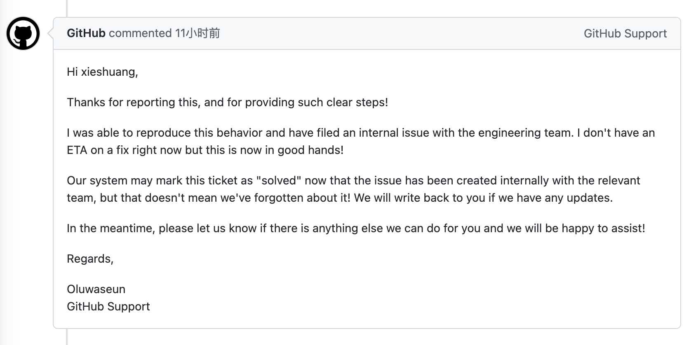

# Github API v3 删除中文名 gist file 失败

内容如题，是一段找 bug 的记录。

## 背景

最近在用 `github api v3` 的 gist 部分，来做个小应用。发现其中删除 gist file 的功能偶发性失败，很上头，，，

经过多次实验，发现剩下的不可删除的文件有一个共同点，`名称中都包含中文`。

## 谁的问题

> 肯定是我的问题，v3 都这么久了，有问题早修了，，，

先看文档，分别验证了 `update`、`add`，中文也都 ok。<br>
因为删除部分并没有提到中文，demo 也没包含，于是猜测是一个隐藏特性，文档不健全。

也看了一些知名库的源码比如 [google/go-github](https://github.com/google/go-github)，但其中并没提及这部分。<br>
在尝试了 urlencode 之后，我去 google 和 github 搜了挺久，，，无果，竟然之前没人遇到过吗？!!

回来后把验证脚本换成 `shell curl`，再次复现。<br>
确认无误后，给 github 提了个工单进行说明。没办法了搞不定，，，这是最后的波纹了

## github 的回复



好吧确实是 github 的问题，在我提交 7 小时后进行了回复。现在就静等修复了，，，

## 测试代码

英文名的文件，可以正常删除：

```bash
curl -L \
  -X PATCH \
  -H "Accept: application/vnd.github+json" \
  -H "Authorization: Bearer <YOUR-TOKEN>"\
  -H "X-GitHub-Api-Version: 2022-11-28" \
  https://api.github.com/gists/GIST_ID \
  -d '{"files":{"hello.py":null}}'
```

如果文件名中包含中文，则会出错：

```bash
curl -L \
  -X PATCH \
  -H "Accept: application/vnd.github+json" \
  -H "Authorization: Bearer <YOUR-TOKEN>"\
  -H "X-GitHub-Api-Version: 2022-11-28" \
  https://api.github.com/gists/GIST_ID \
  -d '{"files":{"中文.md":null}}'
```

响应内容：

```json
{
    "message": "Validation Failed",
    "errors": [
        {
            "resource": "Gist",
            "code": "missing_field",
            "field": "files"
        }
    ],
    "documentation_url": "https://docs.github.com/rest/reference/gists/#update-a-gist"
}
```

## 修复

在工单第一次回复我 `11天` 后，问题得到了修复，现在能正常的删除中文名文件。

## 参考

https://docs.github.com/zh/rest/gists/gists?apiVersion=2022-11-28#update-a-gist
