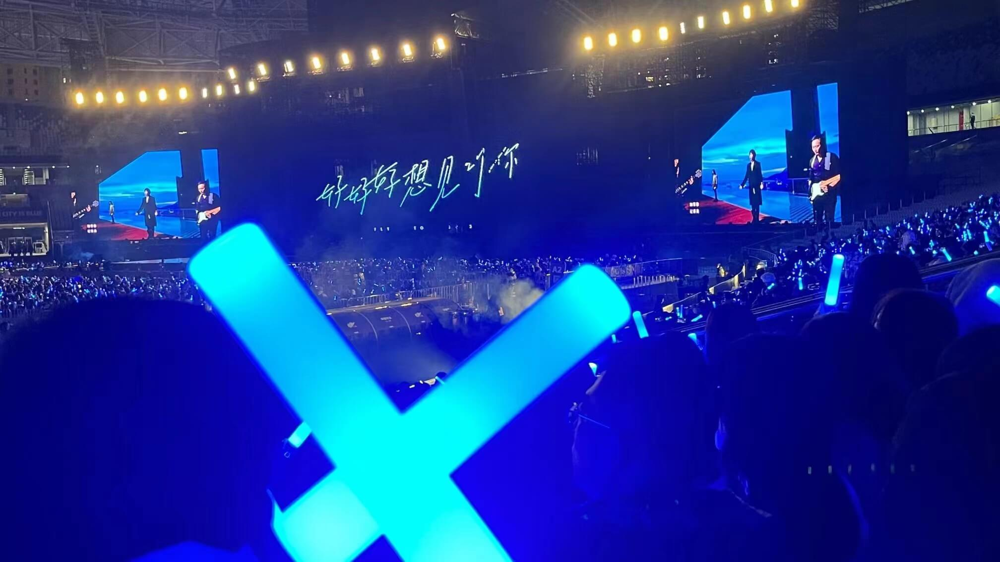

# 秋天的演唱会

今年秋天，短短一个月内连续看了 3 场演唱会，他们的歌我从小听到大 😂😂

## 周杰伦

买的第一张专辑就是《八度空间》，这次 `Jay` 也恰好用「半兽人」开场，现场很是炸裂，侥幸十几年前记得歌词能让我跟着一起唱。

「黄晓明」来了就来了，非要跟着一起跳，，，左拍腿右拍腿强颜欢笑，我都替他尴尬。

## 张韶涵

`张韶涵` 跟 `张含韵` 倒是经常需要想一会儿才能分清楚。 这次是跟朋友去常州看的，一路风雨，还忘了带门票差点没进去。

依然是记忆中实力派的独特嗓音，感觉在最后半小时才达到高潮，high 的不行。

## 五月天

第二次看 `五月天` 了，他跟别人的不一样，要站起来看 =。=

动词打次动词打次，跟着一起蹦跶。从头到尾都是高潮，一刻都不能停！ 虽然有些歌不熟悉，但是没关系使劲喊就行了！！

骤然降温的上海，我在 `7℃` 蹦出一身汗。

<!--  -->

