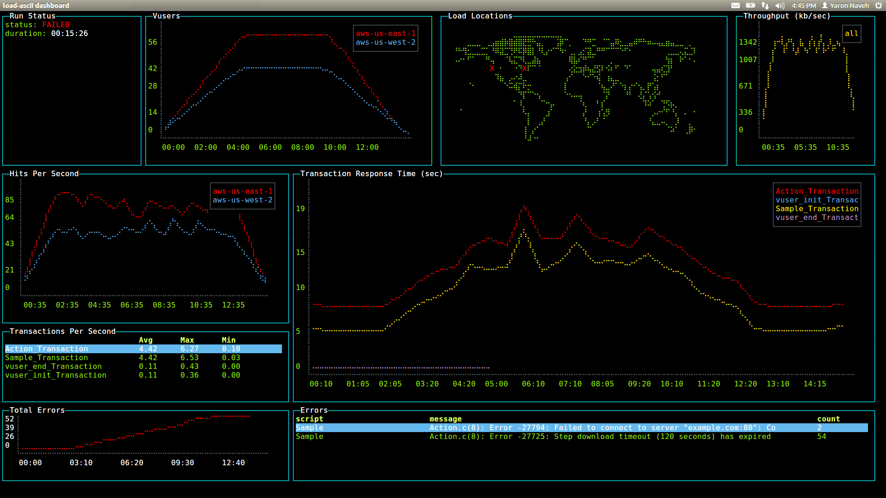
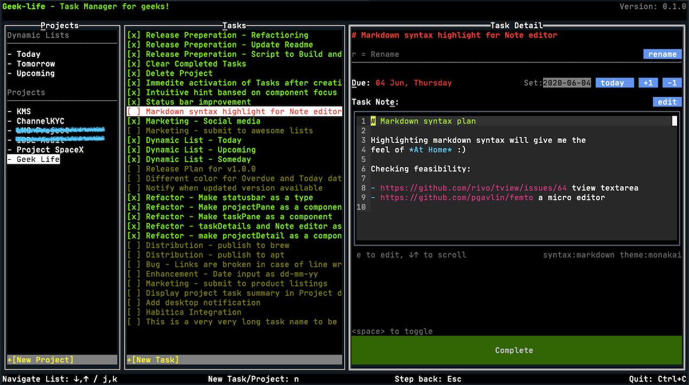
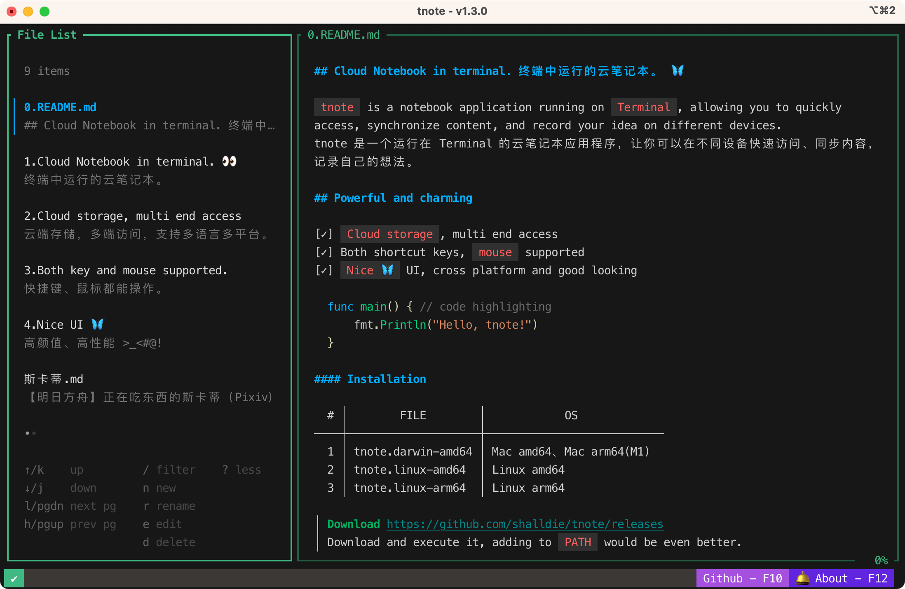
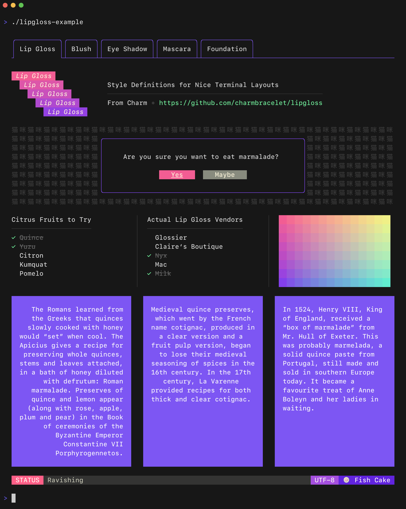

# 运行在终端的应用

`tui`，全称为 `Terminal UI`，意为在终端上绘制图形，结合应用程序即可得到运行在终端的应用程序。

## 流行 TUI 框架一览

陆续尝试过一些 tui 框架，这里简单介绍各框架优劣，以及我的使用体验。

### blessed



评分：`★★★☆☆`

[blessed](https://github.com/chjj/blessed) 是一个基于 nodejs 的终端界面库，提供了高级的终端接口，使在终端上实现可交互的界面。
基于 nodejs 使之面向前端友好，提供了丰富的组件以及大量的 api，让构建应用得心应手。

-   优点：功能极其强大，一个库就似乎可以完成所有的事情。基于 nodejs，面向前端友好。
-   缺点：优点即缺点，功能太多配置太多，使用起来太复杂。基于 nodejs 也意味着难以原生跨平台。最最重要的，这个库已经近 10 年没更新了 😂😂

来都来了，看看这个基于 blessed 的控制台游戏集合：[togame](https://github.com/shalldie/togame)

### tview



评分：`★★★☆☆`

[tview](https://github.com/rivo/tview) 是一款基于 golang 的终端应用框架，提供了一系列常用基础组件，包含了 表单、文本域、表格、弹性布局、Grid 布局、模态框等。
也拥有一定的社区生态，可以找到好用的第三方组件，使用基数也相当的高。

-   优点：类面向对象，组件化程度相当高，对于管理类应用可以快速集成，上手成本较低。
-   缺点：扩展现有组件、新增组件，成本较高，需要对于 tui 应用和现有项目有一定的了解。UI 只适合管理类的应用，比较保守/老旧。

写过一个基于 tview 的记事本程序：https://github.com/shalldie/tnote/tree/ver.tview

### bubbletea



评分：`★★★★☆`

bubbletea 同样基于 golang，非常适合构建复杂交互的终端应用程序，同时还能让命令行程序变得多彩和炫酷。
它是 [charmbracelet](https://github.com/charmbracelet) 家族的一部分，下面分享下我对于这些库的理解和使用。

-   优点：高度灵活，组件化程度高，生态丰富，好看。
-   缺点：上手需要一定的成本。

## bubbletea

bubbletea 是一个强大的 TUI 框架，简单、小巧，内置简单的事件处理机制，可以对外部事件做出响应，比如键盘按键，鼠标点击等。

### 准备&简介

在开始前先引入该库，一般用 `tea` 做别名，毕竟 `bubbletea` 有点长：

```go
package main

import (
    "fmt"
    "os"

    tea "github.com/charmbracelet/bubbletea"
)
```

bubbletea 应用/组件，由一个描述应用程序状态的 `model`，和 `model` 上 3 个简单方法组成：

-   `Init`, 在应用/组件创建的时候会调用，做一些初始化工作，返回一个 `cmd` 来告知框架要执行什么命令。
-   `Update`, 用于响应外部传入的事件，并据此来更新 model，进而触发 ui 更新.
-   `View`, 根据 model 来生成需要在控制台显示的字符串，没错，它的视图全都是字符串比较底层。

### 关于 model

`model` 一般用来存储应用的状态，可以是任何类型，但是大部分情况一般会用 `struct` 来做，更面向对象。

```go
type model struct {
    choices  []string           // items on the to-do list
    cursor   int                // which to-do list item our cursor is pointing at
    selected map[int]struct{}   // which to-do items are selected
}
```

### Init

在 golang 中，struct 的初始化一般都会用工厂，即一个函数去返回 struct 的实例。

```go
func initialModel() model {
	return model{
		// Our to-do list is a grocery list
		choices:  []string{"Buy carrots", "Buy celery", "Buy kohlrabi"},

		// A map which indicates which choices are selected. We're using
		// the  map like a mathematical set. The keys refer to the indexes
		// of the `choices` slice, above.
		selected: make(map[int]struct{}),
	}
}
```

需要给 model 定义 `Init` 方法，它返回 `Cmd` 来告知程序需要做什么工作。如果什么都不需要刻意返回 `nil`，表示 `no command`。

```go
func (m model) Init() tea.Cmd {
    // Just return `nil`, which means "no I/O right now, please."
    return nil
}
```

### Update

`when things happen`，当事件发生时，`Update` 方法会被调用，它会判断发生了啥，并返回新的模型来作为响应，也可以返回 Cmd 来使更多的事件发生。

比如用户按下了某个按键，点击了某部分，鼠标滚轮，或者是自定义的事件。

`事件触发` 以 `Msg` 的形式出现，它可以是任何类型。Msg 是发生的某些 I/O 的结果，例如按键，来自服务端的响应等。
我的经验，用类型来表示事件类型，该类型的值作为事件负荷的载体。类似于 `Payload`。

```go
func (m model) Update(msg tea.Msg) (tea.Model, tea.Cmd) {
    switch msg := msg.(type) {

    // Is it a key press?
    case tea.KeyMsg:

        // Cool, what was the actual key pressed?
        switch msg.String() {

        // These keys should exit the program.
        case "ctrl+c", "q":
            return m, tea.Quit

        // The "up" and "k" keys move the cursor up
        case "up", "k":
            if m.cursor > 0 {
                m.cursor--
            }

        // The "down" and "j" keys move the cursor down
        case "down", "j":
            if m.cursor < len(m.choices)-1 {
                m.cursor++
            }

        // The "enter" key and the spacebar (a literal space) toggle
        // the selected state for the item that the cursor is pointing at.
        case "enter", " ":
            _, ok := m.selected[m.cursor]
            if ok {
                delete(m.selected, m.cursor)
            } else {
                m.selected[m.cursor] = struct{}{}
            }
        }
    }

    // Return the updated model to the Bubble Tea runtime for processing.
    // Note that we're not returning a command.
    return m, nil
}
```

这里的例子，当按下了 `ctrl+c` 或者 `q` 的时候，会返回 `tea.Quit` 命令和 model。这是一个特殊命令，会告知 Bubble Tea 去退出应用程序。

### View

所有的方法中，`View` 是最简单的。就是根据当前 model 的状态，返回一个字符串。字符串就是最终的 UI。

因为视图描述了应用程序的整个 UI，所以不必担心重新绘制逻辑之类的事情。Bubble Tea 会帮你搞定的。

身为前端对状态管理也经常用到，我也有一些不成熟的经验。应用的各个部分状态如果分散到各个组件中去，很难去互相访问到。如果集中管理状态，集中处理业务，就把 `业务层` 和 `UI层` 分离了，能更好的组织业务逻辑，组件就只负责渲染就行。做法是弄一个单例去存储所有的状态，还是用 `Update` 去通知更新，不过 `View` 中会引用这个单例中的值去更新。

```go
func (m model) View() string {
    // The header
    s := "What should we buy at the market?\n\n"

    // Iterate over our choices
    for i, choice := range m.choices {

        // Is the cursor pointing at this choice?
        cursor := " " // no cursor
        if m.cursor == i {
            cursor = ">" // cursor!
        }

        // Is this choice selected?
        checked := " " // not selected
        if _, ok := m.selected[i]; ok {
            checked = "x" // selected!
        }

        // Render the row
        s += fmt.Sprintf("%s [%s] %s\n", cursor, checked, choice)
    }

    // The footer
    s += "\nPress q to quit.\n"

    // Send the UI for rendering
    return s
}
```

### 启动应用

把入口的 model 传递给 `tea.NewProgram`，就能开启一个新的应用。该 model 通常是作为一个 layout 来布局，同样的各个组件也能继续嵌套其它组件，最终形成一个树状结构，入口的 model，即为根结点。

```go
func main() {
    p := tea.NewProgram(initialModel())
    if _, err := p.Run(); err != nil {
        fmt.Printf("Alas, there's been an error: %v", err)
        os.Exit(1)
    }
}
```

## 相关生态

这是我倾心于 bubbletea 的一个重大原因，它拥有很多相关联的库（自己的，第三方的），Issues 和 Discussions 都挺活跃，反馈及时。

### Bubbles

[Bubbles](https://github.com/charmbracelet/bubbles): 常用的 Bubble Tea 组件，比如 text inputs、viewports、spinners 等等。

### Lip Gloss

[Lip Gloss](https://github.com/charmbracelet/lipgloss): TUI 的样式、格式、布局相关的工具库，非常强大！！ 且好看：



### Harmonica

[Harmonica](https://github.com/charmbracelet/harmonica): 一个动画库，能给 tui 添加流程、自然的运动效果。

### BubbleZone

[BubbleZone](https://github.com/lrstanley/bubblezone): 可以给 Bubble Tea 组件便捷的添加鼠标处理事件。

### Glamour

[Glamour](https://github.com/charmbracelet/glamour): Markdown 渲染器，可以在 CLI 应用上渲染出好看的 markdown 内容。

## TNote

基于 Bubble Tea，我写了个运行在 Terminal 的云笔记本应用程序，可以在不同设备快速访问、同步内容，记录自己的想法。

如果你能看到这里，欢迎给 [tnote](https://github.com/shalldie/tnote) 来个 star ~ :D


## 参考

https://charm.sh/

https://github.com/charmbracelet/bubbletea
