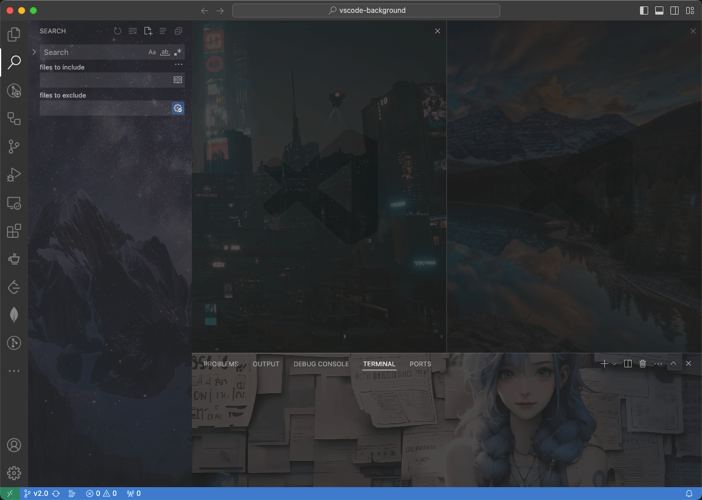
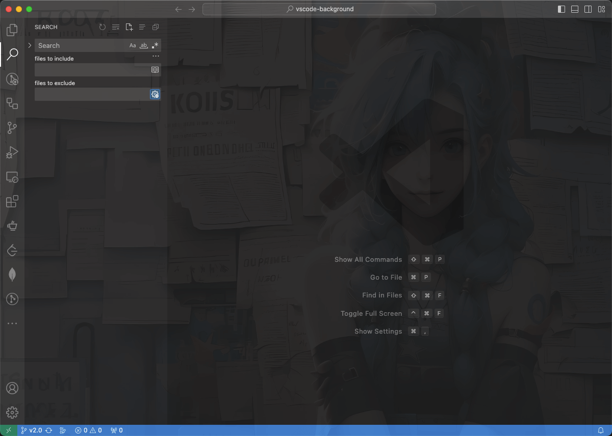
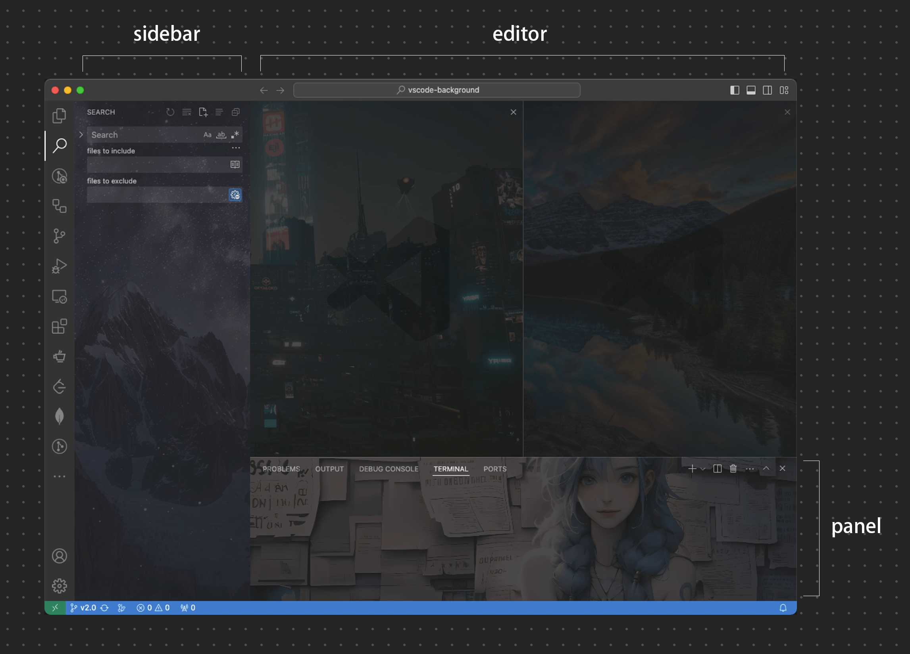
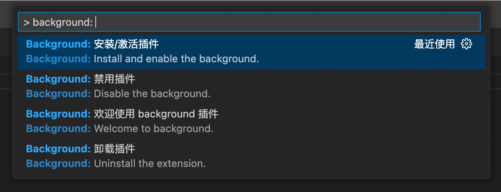

# vscode-background v2

> [background](https://github.com/shalldie/vscode-background) 从第一次发布到现在都8年多了，没想到当时随手写的东西能维护到现在，更没想到有一群喜爱这个插件的朋友，愿意使用它并提供很多建议和帮助。
> 前段时间更新了一波，让夕阳项目发挥发挥余热。新版本拥有更多的功能，会给你带来更好的编码体验！

<!-- 封面区域 -->
<div align="center">

多区域，`editor`、`sidebar`、`panel`



`全屏`



</div>

<!-- 封面区域 end -->

## 安装

有两种安装方式：

1. 从 [Visual Studio Marketplace](https://marketplace.visualstudio.com/items?itemName=shalldie.background) 安装。
2. 在 vscode 里搜索 `shalldie.background`。

## 自定义

可以通过调整配置（in `settings.json`）来满足个性化需求。

[settings.json 是什么](https://code.visualstudio.com/docs/getstarted/settings#_settingsjson) | [怎么打开](https://github.com/shalldie/vscode-background/issues/274)

## 配置项



### 全局配置

| 名称                 |   类型    | 默认值 | 描述         |
| :------------------- | :-------: | :----: | :----------- |
| `background.enabled` | `Boolean` | `true` | 插件是否启用 |

### Editor 编辑器区域配置

通过 `background.editor` 设置编辑器区域配置。

| 名称       |    类型    |    默认值    | 描述                                                   |
| :--------- | :--------: | :----------: | :----------------------------------------------------- |
| `useFront` | `boolean`  |    `true`    | 把图片放在代码的上方或下方。                           |
| `style`    |  `object`  |     `{}`     | 自定义图片样式。                                       |
| `styles`   | `object[]` | `[{},{},{}]` | 为每一个图片自定义样式。                               |
| `images`   | `string[]` |     `[]`     | 自定义图片，支持 `https` 和 `file` 协议。              |
| `interval` |  `number`  |     `0`      | 单位 `秒`，轮播时候图片切换间隔，默认 `0` 表示不开启。 |
| `random`   | `boolean`  |   `false`    | 是否随机展示图片。                                     |

> `style` 指的是 [css style](https://developer.mozilla.org/en-US/docs/Learn/CSS/First_steps/What_is_CSS)， 通过自定义样式可以改变背景图的展示。

example:

```json
{
    "background.editor": {
        "useFront": true,
        "style": {
            "background-position": "100% 100%",
            "background-size": "auto",
            "opacity": 1
        },
        "styles": [{}, {}, {}],
        // 本地图片可以拖到浏览器中，快速从地址栏得到file协议的地址
        "images": ["https://pathtoimage.png", "file:///path/to/local/file"],
        "interval": 10,
        "random": false
    }
}
```

### 全屏、侧边栏、面板 区域配置

通过 `background.fullscreen`、`background.sidebar`、`background.panel` 来进行这些区域的配置。

| 名称       |    类型    |    默认值     | 描述                                                                                   |
| :--------- | :--------: | :-----------: | :------------------------------------------------------------------------------------- |
| `images`   | `string[]` |     `[]`      | 自定义图片，支持 `https` 和 `file` 协议。                                              |
| `opacity`  |  `number`  | `0.91`、`0.2` | 透明度，全屏建议 `0.85 ~ 0.95`，其它建议 `0.1 ~ 0.3`。                                 |
| `size`     |  `string`  |    `cover`    | 等同 css `background-size`, 建议使用 `cover` 来自适应，或者 `contain`、`200px 200px`。 |
| `position` |  `string`  |   `center`    | 等同 css `background-position`， 默认值 `center`。                                     |
| `interval` |  `number`  |      `0`      | 单位 `秒`，轮播时候图片切换间隔，默认 `0` 表示不开启。                                 |
| `random`   | `boolean`  |    `false`    | 是否随机展示图片。                                                                     |

example:

```json
{
    "background.fullscreen": {
        // 本地图片可以拖到浏览器中，快速从地址栏得到file协议的地址
        "images": ["https://pathtoimage.png", "file:///path/to/local/file"],
        "opacity": 0.91,
        "size": "cover",
        "position": "center",
        "interval": 0,
        "random": false
    },
    // `sidebar`、`panel` 的配置与 `fullscreen` 一致
    "background.sidebar": {},
    "background.panel": {}
}
```

## 快捷命令

点击状态栏右下角「Background」按钮，可以快速弹出 background 所有命令：



## 常见问题

> **本插件是通过修改 vscode 的 js 文件的方式运行**

如果遇到问题请查看 [常见问题](https://github.com/shalldie/vscode-background/blob/master/docs/common-issues.zh-CN.md)

## 卸载

请查看 [常见问题#如何删除插件](https://github.com/shalldie/vscode-background/blob/master/docs/common-issues.zh-CN.md#%E5%A6%82%E4%BD%95%E5%88%A0%E9%99%A4%E6%8F%92%E4%BB%B6)

## 感谢这些朋友的 pr 🙏

[](https://github.com/shalldie) [](https://github.com/suiyun39) [](https://github.com/frg2089) [](https://github.com/AzureeDev) [](https://github.com/tumit) [](https://github.com/asurinsaka) [](https://github.com/u3u) [](https://github.com/kuresaru) [](https://github.com/Unthrottled) [](https://github.com/rogeraabbccdd) [](https://github.com/SatoMasahiro2005)

## 贡献指南

这里是 [贡献指南](https://github.com/shalldie/vscode-background/blob/master/docs/contributing.zh-CN.md)。

## 更新日志

可以从 [这里](https://github.com/shalldie/vscode-background/blob/master/CHANGELOG.md) 查看所有的变更内容。

## 分享图片

我们在 [这里](https://github.com/shalldie/vscode-background/issues/106) 分享背景图。

## 从 v1 迁移

v1 的配置已经过时，当前保持一定的兼容性，请参考 [migration-from-v1.md](https://github.com/shalldie/vscode-background/blob/master/docs/migration-from-v1.md) 进行迁移。

## 协议

MIT
