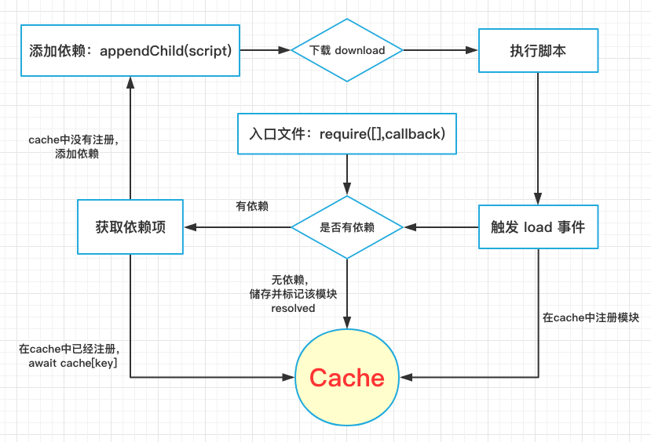

# 实现一个requirejs

## 写在前面

requirejs，众所周知，是一个非常出名的js模块化工具，可以让你使用模块化的方式组织代码，并异步加载你所需要的部分。在很多场景拥有 无需编译，立即上手，兼容良好 等优势。

目前模块化主流方式是 `es module`， amd应用于开发阶段已经比较少了，几乎已经退出了人们的视野。

之所以用 `开发阶段` 这个词，是因为很多模块化方案最终编译的结果实际也是用类amd的方式去组织模块。

对于 `amd`、`cmd`、`commonjs`、`es module` 等概念不再继续bb，本文主要讲如何实现一个类requirejs。

之前在博客园写过一个版本的，去年因为公司 `good coder` 徽章，把代码整理了整理，重新实现了一下，时隔一年多想想放到这里吧。

## Github 仓库

[https://github.com/shalldie/requirejs](https://github.com/shalldie/requirejs)

## 如何使用 requirejs

要实现一个东西的前提，是知道如何去用，这样才能在接下来的分析中，决定实现方式，代码组织。

实际项目上很少用过requirejs，特地去查了一下... 大致分为两种：

### 程序入口

使用 `require` 方法去加载依赖，在回调里面写业务

```js
require(['a.js', 'b.js'], function (a, b) {
    // code...
});
```

### 模块定义

模块定义分两种，一种是 `匿名模块`，一种是`具名模块`。

匿名模块一般用于开发阶段，在打包的时候通过某种工具 比如 [r.js](https://github.com/requirejs/r.js) 把所有用到的模块打包到一起，生成具名模块，模块名就是源文件的路径。

#### 匿名模块

匿名模块有这些定义方式：

    直接用对象来声明，Simple Name/Value Pairs
    这个对象就是该模块内容。

```js
//Inside file my/shirt.js:
define({
    color: "black",
    size: "unisize"
});
```

    传入一个方法，Definition Functions
    方法的返回值是模块内容。

```js
//Inside file my/shirt.js:
define({
    color: "black",
    size: "unisize"
});
```

    声明依赖和方法，Definition Functions with Dependencies
    方法依赖了声明的依赖模块，在依赖的模块加载完毕后才会执行方法

```js
//my/shirt.js now has some dependencies, a cart and inventory
//module in the same directory as shirt.js
define(["./cart", "./inventory"], function(cart, inventory) {
        //return an object to define the "my/shirt" module.
        return {
            color: "blue",
            size: "large",
            addToCart: function() {
                inventory.decrement(this);
                cart.add(this);
            }
        }
    }
);
```

#### 具名模块

具名模块跟匿名模块差不多，唯一的差别是声明的时候第一个参数是模块名(路径)，比如：

```js
//Explicitly defines the "foo/title" module:
define("foo/title",
    ["my/cart", "my/inventory"],
    function(cart, inventory) {
        //Define foo/title object in here.
    }
);
```

## 去实现一个 requirejs

上面陈述了requirejs基本的使用方式，不常见的地方就不赘述了，毕竟我们的目的是去实现一个amd加载器，掌握其原理，并不是取代它。

### 设计方案示意图



这个是我的设计思路，其中主要是分为两部分：`模块定义`、`模块获取`。

### 实现模块定义

这个的重点是加载模块，大家都知道，amd的每个模块，对应的一个js文件，加载模块就是去加载这个js。
模块的定义方式，有3种重载：

1. `define(sender)`
2. `define(deps, sender)`
3. `define(name, deps, sender)`

```js
export async function defineModule(...args) {

    /**
     * name:   模块名称
     * deps:   模块依赖
     * sender: 模块主体
     *
     * 3种情况：
     * sender
     * deps,sender
     * name,deps,sender
     */
    args.reverse();
    let [sender, deps = [], name = ''] = args;

    if (args.length > 3) {
        throw new Error('模块参数数量异常');
    }
    ...
}
```

sender 是一个函数，或者某个对象。deps 是一个数组，表示该模块依赖的其他模块。name 是表示当前模块是一个命名模块，强制使用该名称，一般是打包工具生成这种模块，不建议自己直接这么写。

### 实现模块获取

从上面我们可以看到，模块是通过执行一个函数，用传参的方式把所要用到的模块加载到某个地方保存起来。那么看到这个有没有想到什么呢？

我首先想到的就是 jsonp ，动态执行一个函数，把数据放进去，对得上，完美。从这个思路，我实验了一下，在这里直接说结论： script标签在动态加载到页面后，首先去服务器拿对应地址发起请求，然后在文件下载完全后，执行该js文件中的内容，执行完毕后，会触发该script标签的load事件。

```bash
    ┌───────────────────────┐
    │  appendChild(script)  │
    └──────────┬────────────┘
    ┌──────────┴────────────┐
    │       download        │
    └──────────┬────────────┘
    ┌──────────┴────────────┐
    │      run script       │
    └──────────┬────────────┘
    ┌──────────┴────────────┐
    │      emit event       │
    └───────────────────────┘
```

也就是说，通过给load事件注册方法，我们可以知道最后一个加载的模块(js文件)，来自哪里，什么时候执行完全。这样就确定了，并行加载多个js文件时，匿名模块所属来源。这里不讨论兼容的问题，低版本ie对应的是其他事件:onreadystatechange，我没用过。

在模块加载后，我们用一个函数来将模块填充到字典中，类似于一个 `触发器`，每次加载一个模块，模块中包含这个函数并执行，处理依赖关系，并将最后的结果保存。

在模块的加载中，因为可能会同时加载多个模块（js文件），并不能确定到底是哪一个先加载完全。但是我们知道，js是单线程，在js文件下载完全后，会先把js文件中的内容执行完毕，然后再触发load事件，这个顺序是可以保证的，所以就可以使用一个变量来保存最近加载的模块，来知道匿名模块的所属路径。

```js
/**
 * 根据 模块名/路径 获取某个模块
 *
 * @export
 * @param {string} name 模块名/路径
 * @returns {Promise<void>}
 */
export async function getModule(name) {
    // 尝试从缓存拿
    if (core.cache[name]) {
        return core.cache[name].promise;
    }

    const moduleDfd = new Deferred();
    core.cache[name] = moduleDfd;

    // 模块加载完毕，立马会触发 load 事件，由此来确定模块所属
    await _.loadScript(name + '.js');
    currentModuleNameDfd.resolve(name);
    return moduleDfd.promise;
}
```

不论是匿名模块，还是命名模块，都可能依赖其他的模块，所以并不能确定在模块加载完之后，就可以立即使用，要等待所有的依赖项都加载完毕，所以一个模块的最终返回值我使用的一个promise来保存。这样就可以方便的在状态变更后才添加下一步的处理操作，从逻辑上简化整个流程控制。

### 实现程序入口

程序入口只是简单封装了一下模块获取，但是因为有可能被打包工具把模块打包到一起，使当前文件有具名模块，所以需要 `setTimeout` 一下，让可能的具名模块先注入 `cache` ，然后再执行主逻辑。

```js
export async function requireModule(deps, callback) {
    // 等可能存在的具名模块先载入cache
    await _.sleep(0);
    const argsPro = deps.map(depUrl => getModule(_.pathJoin(core.rootUrl, depUrl)));
    const args = await Promise.all(argsPro);
    _.getType(callback) === 'function' && callback(...args);
}
```

## 结语

文章至此结束，一个只有`5.6k`的类requirejs库就实现类。

有兴趣可以去 [Github](https://github.com/shalldie/requirejs) 看一下代码，因为只是想表述原理并不是想取代requirejs或者应用于生产环境，所以用了新语法(api)，需要polyfill。无依赖版本可以查看 `no-dep` 分支。
